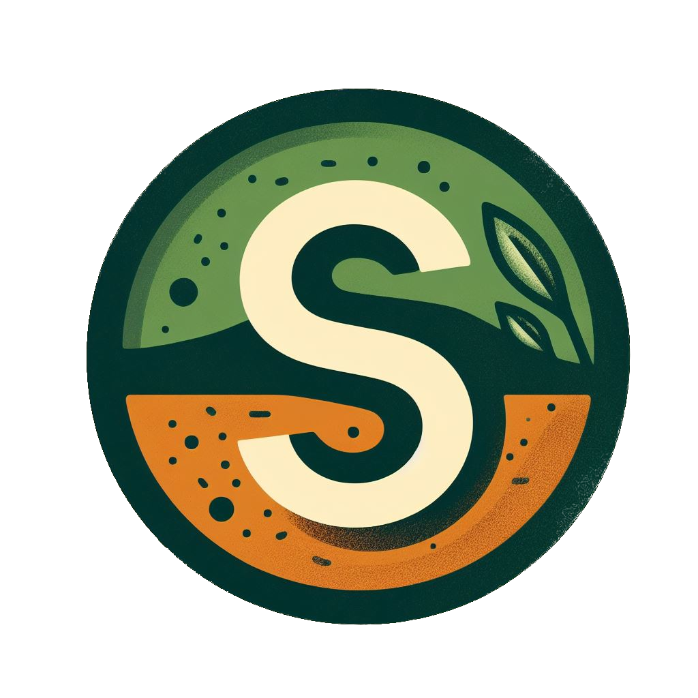

#  SELETA

`Análise e Desenvolvimento de Sistemas`

`Projeto - EIXO 2`

O projeto Seleta consiste em um aplicativo para que pessoas com restrições alimentares encontrem de maneira mais rápida e descomplicada produtos específicos que possam consumir. Dessa forma, não será preciso procurar em diversos estabelecimentos por determinado produto, será possível consultar, fazer listas de compras e ir direto no mercado mais próximo com a disponibilidade do item.

## Integrantes

* Ana Carolina Nazareth Nogueira
* Gabriela Penaforte
* Naianna Duarte
* Nikita Ceccon
* Victor Bastos

## Orientador

* Luciana de Nardin

## Instruções de utilização

Para acessar a aplicação Seleta, siga os passos descritos abaixo: 
- Link de acesso
  
  Para abrir a aplicação copie e cole o link a seguir na barra de endereço do seu navegador 
  
  https://seleta.azurewebsites.net/
  
- Usuário Teste
  
  Foi criado a seguinte credencial de usuário teste para possibilitar os testes e o acesso ao sistema:
  
  Email: usuarioteste@gmail.com
  
  Senha: 123456

- Instruções de acesso
  
  1. Abra o navegador de sua preferência;
  2. Insira o link de acesso a aplicação Seleta;
  3. Pressione "Enter" para carregar a página, em seguida você será redirecionado para a home page da aplicação;

# Documentação

<ol>
<li><a href="docs/01-Documentação de Contexto.md"> Documentação de Contexto</a></li>
<li><a href="docs/02-Especificação do Projeto.md"> Especificação do Projeto</a></li>
<li><a href="docs/03-Metodologia.md"> Metodologia</a></li>
<li><a href="docs/04-Projeto de Interface.md"> Projeto de Interface</a></li>
<li><a href="docs/05-Arquitetura da Solução.md"> Arquitetura da Solução</a></li>
<li><a href="docs/06-Template Padrão da Aplicação.md"> Template Padrão da Aplicação</a></li>
<li><a href="docs/07-Programação de Funcionalidades.md"> Programação de Funcionalidades</a></li>
<li><a href="docs/08-Plano de Testes de Software.md"> Plano de Testes de Software</a></li>
<li><a href="docs/09-Registro de Testes de Software.md"> Registro de Testes de Software</a></li>
<li><a href="docs/10-Plano de Testes de Usabilidade.md"> Plano de Testes de Usabilidade</a></li>
<li><a href="docs/11-Registro de Testes de Usabilidade.md"> Registro de Testes de Usabilidade</a></li>
<li><a href="docs/12-Apresentação do Projeto.md"> Apresentação do Projeto</a></li>
<li><a href="docs/13-Referências.md"> Referências</a></li>
</ol>

# Código

<li><a href="src/README.md"> Código Fonte</a></li>

# Apresentação

<li><a href="presentation/README.md"> Apresentação da solução</a></li>
