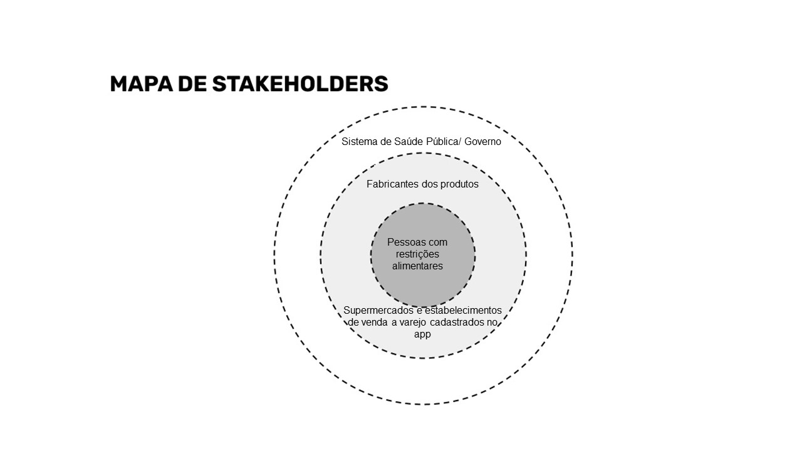

# Documentação de contexto

Com o aumento de diagnósticos médicos relacionados à intolerância e alergia ou com a percepção de reações do organismo a certos alimentos, as restrições alimentares têm ganhado cada vez mais destaque nos hábitos de consumo da população. Tendo isso em vista, a indústria alimentícia tem sido cada vez mais chamada a olhar para as novas demandas dos consumidores e suas especificidades, bem como desafiada a considerar as particularidades de vários grupos de pessoas.

Os números relacionados às restrições alimentares expressam que essa questão não se trata mais de casos isolados. De acordo uma pesquisa realizada pela Euromonitor Internacional (2011), 75% da população mundial poderá apresentar intolerância a lactose ou má absorção de lactose ao longo da vida. Esses números, somados aos números relacionados a outros tipos de restrições alimentares, exprimem a urgência do tema.

Para além das circunstâncias internas dos consumidores, a experiência de consumo pode ser crucial na hora da compra e pode afetar as intenções dos sujeitos (BATISTA, 2022).  A falta de informações centralizadas prejudica a experiência de compra das pessoas com restrições alimentares, uma vez que elas enfrentam dificuldade em encontrar produtos seguros para o consumo. Além disso, uma das dificuldades que as pessoas com restrições alimentares encontram está relacionada à rotulagem dos alimentos, pois dependem das informações sobre alérgenos que deveriam estar claramente contidas nos rótulos dos produtos e, muitas vezes, isso não ocorre. 

Ademais, de acordo com Bracarense et al. (2022), novas dinâmicas de comercialização emergiram com a pandemia do Covid-19. Foi observado o aumento das compras por meio digital de categorias de produtos que não tinham uma forte presença on-line, como alimentos, bebidas e material de limpeza, o que expressa um novo padrão de consumo. Este fato se tornou preocupante pois existe uma impossibilidade de acesso a rotulagem nas compras online, o que dificulta a compra segura e demonstra mais uma vez a necessidade de um ambiente que centralize esses alimentos e facilite o acesso.

Portanto, atender esta demanda crescente pode beneficiar os mercados ao aumentar a fidelidade do cliente, atrair um público mais amplo e diversificado, demonstrar sensibilidade às necessidades individuais e melhorar a reputação da marca por meio do fornecimento de opções inclusivas e seguras. 

Em suma, é imprescindível a criação de uma plataforma centralizada que reúne informações detalhadas sobre produtos alimentares adequados para diferentes restrições alimentares, os diferentes mercados e comércios onde esses produtos podem ser encontrados e que também oferece a opção de montar listas de compras baseadas nos produtos de sua escolha. Dessa forma, os consumidores saberão o que estão consumindo e conseguem encontrar mais facilmente o que desejam comprar, o que melhora sua experiência de compra, reduz riscos à saúde e proporciona maior tranquilidade ao fazerem escolhas alimentares.

## Problema

O problema que se busca resolver com esta proposta é a ausência de uma fonte centralizada de informações sobre produtos adequados para pessoas com restrições alimentares nos mercados.

## Objetivos

O objetivo geral deste trabalho é desenvolver uma aplicação que permita a indivíduos com restrições alimentares localizar estabelecimentos que ofereçam produtos adequados às suas necessidades, sendo elas, intolerância à lactose, intolerância ao glúten e diabetes. O aplicativo também atenderá pessoas com dieferentes opções alimentares como o veganismo, por exemplo.  

Os principais objetivos especificos são:
- Facilitar o acesso a produtos indicados para cada restrição;
- Otimizar o tempo do usuário ao direcioná-lo para o supermercado que ofereça o produto específico;
- Disponibilizar estabelecimentos de acordo com a localização do usuário;
- Incentivar estabelecimentos a disponibilizar produtos para atenderem aos usuários da aplicação.

## Justificativa

Existem vários tipos de intolerâncias alimentares. A intolerância ao glúten (a proteína do trigo) e a intolerância à lactose (o açúcar do leite) são as mais comuns, de acordo com estudo do DataFolha, cerca de 53 milhões de pessoas sofrem com desconforto intestinal causado pela lactose, isso corresponde a 35% da população nacional de acordo com o site da Sensilatte (2017) e há mais 2 milhões de pessoas no país com sensibilidade ao glúten conforme pesquisa do site especializado Medical News Today, publicada na revista Veja (2017). As desordens relacionadas ao glúten incluem, por exemplo, a doença celíaca, a sensibilidade ao glúten não celíaca e a alergia ao trigo. Estima-se que 1% da população apresente a doença celíaca, 6% tenham sensibilidade ao glúten não celíaca e no caso da alergia ao trigo a prevalência é de 15%-20% em crianças (CRUCINSKY, DAMIÃO, CASTRO, 2021).   
Já a intolerância a lactose pode ser classificada como congênita, primária e secundária. A congênita é diagnosticada no nascimento da criança e é uma condição genética herdada dos pais e refere a ausência completa de lactase jejunal. A primária é a mais comum e ocorre quando há diminuição naturalmente a produção de lactase. A secundária ou adquirida surge de lesões no intestino delgado ou como sequela de alguma doença. Um estudo apontou que a intolerância à lactose está presente em 65% da população mundial (BATISTA, ASSUNÇÃO, PENAFORTE, JAPUR, 2018).  
Apesar das alergias e intolerâncias alimentares serem um problema crescente em todo o mundo, ainda hoje pessoas com restrições alimentares tem dificuldade em encontrar produtos que atendam às suas necessidades. Por esse motivo, a ideia de desenvolvimento da aplicação é proporcionar um ambiente a essas pessoas que facilite o conhecimento e acesso a produtos que possam ser consumidos com segurança.  
Sob o ponto de vista dos supermercados, a aplicação proposta poderá ajudar na compreensão do comportamento dos consumidores de produtos relacionados a restrições alimentares, podendo pensar em estratégias para alcançar um maior número de pessoas.

## Público-alvo

Embora qualquer pessoa possa usufruir desta solução, foi determinado como público-alvo: 

- pessoas com restrições alimentares. 

De forma secundária, também se benefiarão com o uso do aplicativo, os estabelecimentos comerciais que fazem a venda dos produtos específicos bem como os próprios fabricantes, pois ambos podem ter aumento em seu número de vendas.

Em terceiro plano, o próprio sistema de saúde público poderá se beneficiar do aplicativo, uma vez que, as pessoas se alimentem conforme as suas necessidades precisarão de atendimento médico por motivos de reações alérgicas e advérsas com menor frequência.

