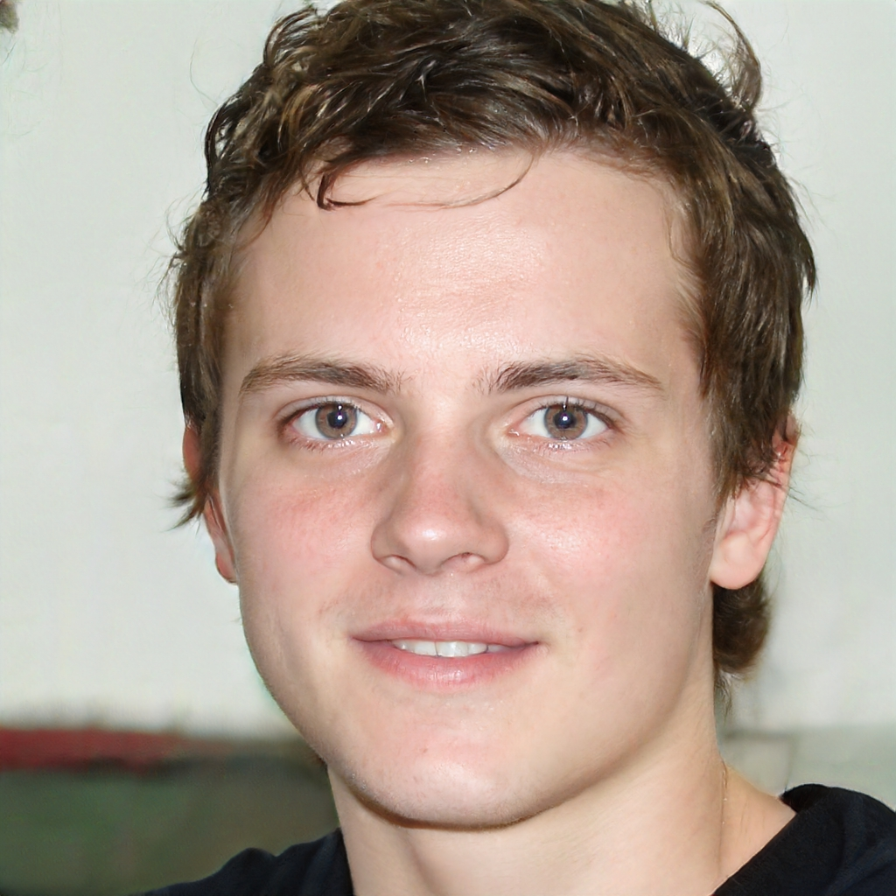

# Especificações do Projeto

 A definição do problema e dos principais pontos a serem discutidos neste projeto foram baseados em informações obtidas em entrevistas com usuários conduzidas pela equipe de trabalho. Os detalhes levantados ao longo desse processo foram consolidados na forma de personas e histórias de usuários. 
  

## Personas

Para ajudar no entendimento do problema e melhor identificar as necessidades dos usuários, foram levantadas as personas a seguir.

**Quadro 1 – Entrevista com a primeira persona** 

|  | **Ricardo**   50 anos|
|:---------------------------------------:|:-------------------------------:|
|**Profissão** | Engenheiro |
|**Restrição** | Diabetes |
|**Motivação** | Busca alimentos com baixo teor de açúcar e carboidratos para manter o controle da glicemia. |
|**Comportamento** | Valoriza informações nutricionais claras nos produtos. Gosta de planejar as refeições com antecedência e busca por lanches saudáveis. |
|**Desafio** | Encontrar alimentos que tenham baixo teor de açúcar e carboidratos, com informações nutricionais claras. |

**Fonte:** Elaborado pelos autores. 

**Quadro 2 – Entrevista com a segunda persona** 

|  | **Eduardo**   21 anos|
|:---------------------------------------:|:-------------------------------:|
|**Profissão** | Estudante |
|**Restrição** | Doença celíaca |
|**Motivação** | Busca por alimentos sem glúten para evitar reações alérgicas e problemas de saúde. |
|**Comportamento** | Interessado em receitas caseiras e produtos específicos para celíacos. Gosta de experimentar novos sabores. |
|**Desafio** | Encontrar estabelecimentos que vendam alimentos sem glúten e que estejam cientes das precauções necessárias para evitar contaminação cruzada. Encontrar produtos com valores acessíveis. |

**Fonte:** Elaborado pelos autores. 

**Quadro 3 – Entrevista com a terceira persona** 

|  | **Amanda**   30 anos|
|:---------------------------------------:|:-------------------------------:|
|**Profissão** | Educadora física |
|**Restrição** | Intolerância à lactose |
|**Background** | Amanda nasceu com deficiência visual devido a uma malformação congênita. Os seus pais sempre a protegeram ao máximo, mas quando se tornou adulta, Amanda entrou na faculdade, se apaixonou pela tecnologia e viu nela uma aliada para lidar com as limitações impostas pela sociedade.|
|**Motivação** | Deseja facilitar sua rotina diária e explorar novas receitas, adaptadas a sua restrição alimentar. Sua motivação envolve principalmente superar as barreiras de acessibilidade na busca por produtos sem lactose para manter uma dieta saudável e evitar desconfortos gastrointestinais. |
|**Comportamento** | Gosta de produtos naturais e orgânicos. Frequenta restaurantes e cafeterias que oferecem opções sem lactose. Utiliza o leitor de tela NVDA para navegar nas páginas Web, não é ativa nas redes sociais, mas utiliza a internet para realizar estudos da faculdade e para buscar informações sobre os alimentos, antes de comprá-los. |
|**Desafio** | Encontrar estabelecimentos que ofereçam uma variedade de opções de alimentos sem lactose. Outro grande desafio é a navegação pelos sites, que não são adaptadas aos leitores de telas.|

**Fonte:** Elaborado pelos autores. 

**Quadro 4 – Entrevista com a quarta persona** 

|  | **Adriana**   45 anos|
|:---------------------------------------:|:-------------------------------:|
|**Profissão** | Empreendedora |
|**Background** | Tem um estabelecimento especializado na venda de produtos alimentares para pessoas com restrições alimentares. |
|**Motivação** | Comprometida em oferecer soluções nutritivas e saborosas para indivíduos com diferentes restrições e necessidades alimentares. |
|**Comportamento** | É ativa nas redes sociais, compartilhando dicas de alimentação saudável e informações sobre os produtos que vende. |
|**Desafio** | Aumentar o número de consumidores de seus produtos. |

**Fonte:** Elaborado pelos autores. 

**Quadro 5 – Entrevista com a quinta persona** 

|  | **Verônica**   45 anos|
|:---------------------------------------:|:-------------------------------:|
|**Profissão** | Auxiliar de serviços gerais  |
|**Restrição** | Limitação de tempo, não pode se ausentar por longos períodos |
|**Background** | Verônica trabalha 40 horas por semana, além do tempo com deslocamento. Aos 35 anos descobriu que estava grávida de Davi. Atualmente Davi tem 5 anos, aos 3 anos foi diagnosticado com autismo e mais recentemente com doença celíaca. Verônica tem o suporte apenas da sua mãe, que fica com o filho durante seu turno de trabalho. O tempo que resta no seu dia é muito restrito e ela tenta dar o máximo de atenção e suporte para Davi nas horas livres. |
|**Motivação** | Verônica deseja que seu filho Davi tenha acesso aos alimentos adequados à doença celíaca, sem a necessidade de despender muito tempo das poucas horas que restam do seu dia.|
|**Comportamento** | Verônica não tem muita intimidade com a tecnologia, costuma usar apenas aplicativos de mensagens instantâneas, pois participa de grupos de mães com filhos autistas, onde acompanha notícias e pesquisas sobre o tema.|
|**Desafio** | O maior desafio de Verônica é equilibrar as necessidades do filho, as demandas do trabalho e as outras responsabilidades diárias.|

**Fonte:** Elaborado pelos autores. 

## Histórias de Usuários

A partir do entendimento das personas identificadas para o projeto, foram estabelecidas as seguintes histórias de usuário.

**Quadro 6 – História de usuários** 

|EU COMO...   `PERSONA`| QUERO/PRECISO ...   `FUNCIONALIDADE` |PARA ...   `MOTIVO/VALOR`                 |
|--------------------|------------------------------------|----------------------------------------|
|Ricardo  | Encontrar alimentos com informações nutricionais claras em seus rótulos | Ingerir apenas alimentos com baixo teor de açucar e carboidratos |
|Ricardo  | Descobrir novas opções de alimentos compatíveis com a restrição alimentar | Diversificar as opções de lanches |
|Eduardo  | Encontrar estabelecimentos que vendam produtos específicos para celíacos  | Preparar refeições caseiras sem correr o risco de ingerir glúten |
|Eduardo  | Comparar produtos e preços  | Encontrar produtos com valores mais acessíveis |
|Amanda   | Encontrar estabelecimentos que ofereçam produtos e alimentos para intolerantes a lactose | Evitar desconfortos gastrointestinais |
|Amanda   | Encontrar um site adaptado a leitores de telas | Conseguir navegar na plataforma para buscar informações sobre os alimentos antes de comprá-los |
|Adriana  | Divulgar produtos para pessoas com restrições alimentares | Aumentar o número de consumidores em seu estabelecimento |
|Adriana  | Identificar quais produtos são mais procurados/pesquisados pelas pessoas que tem restrição alimentar | Entender o comportamento desse tipo de consumidor |
|Verônica | Encontrar uma plataforma intuitiva e fácil de navegar | Localizar de forma rápida estabelecimentos que vendem alimentos atendem a dieta específica do filho |
|Verônica | Encontrar uma plataforma que mostre de forma simples diferentes produtos para celíacos | Otimizar seu tempo planejando a alimentação adequada para o filho |

**Fonte:** Elaborado pelos autores. 

## Requisitos

O escopo do projeto é definido por meio de requisitos funcionais e não funcionais, a fim de descrever todas as funcionalidades que o usuário poderá encontrar, como também os aspectos gerais que precisam ser apresentados pela ferramenta. 

### Requisitos Funcionais

Na tabela a seguir estão listados os requisitos funcionais do projeto, bem como a prioridade de entrega de cada item. 

**Quadro 7 – Requisitos funcionais** 

|ID    | Descrição do Requisito  | Prioridade |
|------|-----------------------------------------|----|
|RF-001| A aplicação deve apresentar na página inicial instruções sobre como navegar na plataforma | ALTA |
|RF-002| A aplicação deve permitir que o usuário visitante pesquise por produtos em qualquer localidade e que atenda a qualquer restrição alimentar | ALTA |
|RF-003| A aplicação deve permitir que o usuário visitante pesquise produtos, independente do tipo específico de restrição alimentar e da localidade que eles se encontram, resultando em todos os produtos equivalentes ao que foi pesquisado | ALTA |
|RF-004| A aplicação deve permitir que o usuário visitante pesquise produtos de acordo com tipo específico de restrição alimentar, resultando em todos os produtos próprios para o tipo de restrição pesquisado | ALTA |
|RF-005| A aplicação deve permitir que o usuário visitante busque por produtos desejados e/ou estabelecimentos de acordo com a localidade inserida no filtro de pesquisa | ALTA |
|RF-006| A aplicação deve permitir que o usuário visitante crie e gerencie listas de compras com produtos selecionados  | ALTA |
|RF-007| A aplicação deve solicitar nome da lista e e-email para compartilhamento sempre que o usuário visitante criar uma lista de compras | ALTA |
|RF-008| A aplicação deve permitir que o estabelecimento crie e gerencie os itens da sua conta | ALTA |
|RF-009| A aplicação deve permitir o estabelecimento especificar a sua localidade | ALTA | 
|RF-010| A aplicação deve permitir que o estabelecimento adicione e gerencie seus produtos | ALTA | 
|RF-011| A aplicação deve garantir que o estabelecimento forneça informações detalhadas sobre os produtos | ALTA | 
|RF-012| A aplicação deve garantir que o estabelecimento indique claramente qual(is) restrição(ões) alimentar(es) o produto atende | ALTA |
|RF-013| A aplicação deve permitir que o usuário visitante busque por produtos desejados de acordo com a categoria inserida no filtro de pesquisa | MÉDIA |
|RF-014| A aplicação deve oferecer a opção de realizar download da lista de compras elaborada | MÉDIA |
|RF-015| A aplicação deve oferecer a opção de enviar a lista de compras elaborada direto para o e-mail do usuário visitante  | BAIXA |

### Requisitos não Funcionais

A tabela a seguir especifica os requisitos não funcionais que devem ser atendidos pelo projeto. 

**Quadro 8 – Requisitos não funcionais** 

|ID     | Descrição do Requisito  |Prioridade |
|-------|-------------------------|----|
|RNF-001| A aplicação deve ser publicada em um ambiente acessível publicamente no GitHub Pages | ALTA | 
|RNF-002| A aplicação deve ser compatível com os principais navegadores do mercado (Google Chrome, Firefox, Microsoft Edge) | ALTA | 
|RNF-003| A aplicação deve ser responsiva, permitindo a visualização tanto em desktops e notebooks, quanto em celulares com telas de variados tamanhos | MÉDIA | 
|RNF-004| A aplicação deve possuir uma interface simples, apresentando as informações de forma visual e acessível | MÉDIA | 
|RNF-005| A aplicação deve estar disponível para acesso a qualquer horário do dia | MÉDIA | 
|RNF-006| A aplicação deve ter bom nível de contraste entre os elementos da tela em conformidade | MÉDIA | 
|RNF-007| A aplicação deve ser organizada da melhor forma para facilitar o desempenho do leitor de tela | MÉDIA | 
|RNF-008| A aplicação deve processar requisições do usuário em no máximo 5s |  BAIXA | 

## Restrições

As questões que restringem a execução desse projeto e que refletem as obrigações para o desenvolvimento do trabalho, são apresentadas na tabela a seguir.

|**ID**| **Restrição**                                             |
|--|-------------------------------------------------------|
| RE-01 | O projeto deve ser entregue no final do semestre letivo, sendo 04/12/2023 a data limite. |
| RE-02 | O sistema deve estar acessível na web.       |
| RE-03 | A equipe desenvolvedora deve ser composta apenas pelos alunos que fazem parte do projeto.       |
| RE-04 | O projeto deve conter um módulo de back-end e um módulo de front-end. |
| RE-05 | O sistema deve estar em conformidade com a Lei Geral de Proteção de Dados (LGPD). |

## Diagrama de Casos de Uso

O diagrama de casos de uso é o próximo passo após a elicitação de requisitos, que utiliza um modelo gráfico e uma tabela com as descrições sucintas dos casos de uso e dos atores. Ele contempla a fronteira do sistema e o detalhamento dos requisitos funcionais com a indicação dos atores, casos de uso e seus relacionamentos. 

As referências abaixo irão auxiliá-lo na geração do artefato “Diagrama de Casos de Uso”.

> **Links Úteis**:
> - [Criando Casos de Uso](https://www.ibm.com/docs/pt-br/elm/6.0?topic=requirements-creating-use-cases)
> - [Como Criar Diagrama de Caso de Uso: Tutorial Passo a Passo](https://gitmind.com/pt/fazer-diagrama-de-caso-uso.html/)
> - [Lucidchart](https://www.lucidchart.com/)
> - [Astah](https://astah.net/)
> - [Diagrams](https://app.diagrams.net/)
