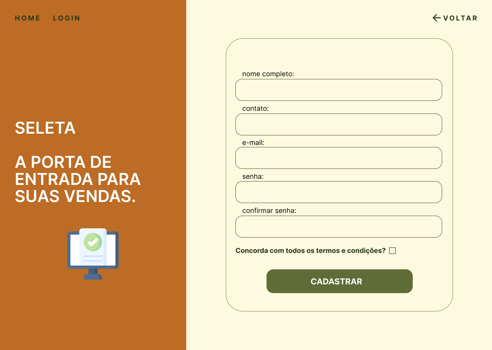

# Projeto de Interface

 Dentre as preocupações para a montagem da interface do sistema, foi estabelecido foco em agilidade e usabilidade para que a ferramenta alcance seu propósito. Sendo assim, nos itens abaixo, será possível ter uma visão geral da interação do usuário pelas telas do sistema e o protótipo das telas com as funcionalidades que fazem parte do sistema.
  
 

## Diagrama de Fluxo

 

  O fluxo de interação do usuário pelas telas do sistema é mostrado no fluxograma visto na Figura 4. Cada uma das telas deste fluxo é detalhada na seção de Wireframes a seguir. Para visualizar o wireframe interativo, acesse o ambiente do projeto no
[Figma](https://www.figma.com/proto/Yv3GxmOYAwGhPL5l7UQzjB/Seleta?type=design&node-id=3-756&t=Q9Hd3wNGC9FAQ3Fo-0&scaling=min-zoom&page-id=0%3A1&starting-point-node-id=3%3A756).
  
 
 
 
 

 
<b>Figura 4 </b>- Diagrama de fluxo
  
 

## Wireframes

A seguir são apresentados os protótipos de interface para indicar a estrutura e layout do site, bem como a interação entre suas páginas. 

### Tela - Home Page e buscar produtos

 A Home Page começa apresentando o propósito e os valores da plataforma por meio de um carrossel. Além disso, é a tela onde o usuário visitante pode fazer sua busca pelos produtos desejados, aplicando os filtros que quiser e precisar (categoria, localidade e restrição alimentar). Nesta página, também se encontrará o botão para criar uma lista de compras, tendo dicas de como realizar essa ação.
   
 

   

 
<b>Figura 5</b> - Home Page do site
  
 

 
<b>Figura 6</b> - Imagem que mostra os filtros de pesquisa que podem ser aplicados nos produtos
  
 

 
<b>Figura 7</b> - Imagem que mostra a segunda parte do carrossel com o lema da plataforma
  
 

 
<b>Figura 8</b> - Imagem que mostra a terceira parte do carrossel 
  
 

 
<b>Figura 9</b> - Imagem que mostra o resultado de busca de produtos
  
 

### Tela - Perfil do produto

 Ao pesquisar os produtos desejados na página inicial, o usuário pode clicar em cima do botão "Ver detalhes" e o site será redirecionado para a página do Perfil do produto, onde se encontrarão a descrição e informações adicionais sobre o produto.
  
 

   

 
<b>Figura 10</b> - Tela de Perfil do produto
  

### Tela - Lista de compras

 A Lista de compras é a tela para onde o usuário é redirecionado após o usuário inserir seu e-mail e selecionar os produtos que deseja adicionar na lista. Nesta página, o usuário pode gerenciar os produtos e escolher se prefere fazer download da lista ou enviar para um e-mail.
  
 

   

 
<b>Figura 11</b> - Tela de Lista de compras
  

  ### Tela - Cadastro do usuário 

 Caso o usuário queira anunciar seus produtos no site, ele deverá clicar em um dos botões para ser redirecionado a página de cadastro. A tela de cadastro do usuário é utilizada para criar o acesso ao sistema. Caso já tenha cadastro, o usuário poderá ser direcionado para a tela de login também por essa tela. 
  
 

 
<b>Figura 12</b> - Tela de Cadastro

### Tela - Login do usuário

 Para os usuários que já possuem uma conta, o acesso é feito pela tela de login. Para entrar, bastar clicar no botão "Login", o site será redirecionado para a tela e o usuário deve informar o email e senha escolhida no momento do cadastro. Caso seja o primeiro acesso do usuário, ele poderá ser direcionado para a tela de cadastro também por essa tela. 
  
 

 
<b>Figura 13</b> - Tela de Login/Entrar
  

  ### Tela - Perfil do usuário

 Tela de Perfil do usuário é o local onde o usuário poderá adicionar e gerenciar os seus estabelecimentos.
  
 

 
<b>Figura 14</b> - Tela de Perfil do usuário
  

### Tela - Cadastro de estabelecimento

 Esta tela é onde o usuário irá colocar todas as informações pedidas para realizar o cadastro do seu estabelecimento no site.
  
 

 
<b>Figura 15</b> - Tela de Cadastro de estabelecimento
  

### Tela - Gerenciar estabelecimentos

 Esta tela é onde o usuário poderá escolher um de seus estabelecimentos cadastrados para abrir seu perfil, editar suas as informações ou até mesmo excluir o estabelecimento da plataforma.
  
 

 
<b>Figura 16</b> - Tela de Gerenciamento de estabelecimentos
  

### Tela - Gereciamento de produtos

 Ao clicar em um estabelecimento, o site será redirecionado para essa tela, onde aparecerão todos os produtos cadastrados neste estabelecimento. O usuário pode escolher cadastrar um novo produto, editar ou excluir um produto já cadastrado.
  
 

 
<b>Figura 17</b> - Tela de Gerenciamento de produtos
  

### Tela - Cadastro de produto

 Ao clicar em cadastrar produto, o usuário será direcionado para essa tela, onde ele irá inserir todas as informações pedidas sobre o novo produto e, no final da página, clicará em Cadastrar para subir o produto para a plataforma.
  
 

 
<b>Figura 18</b> - Tela de Cadastro de produtos
  

