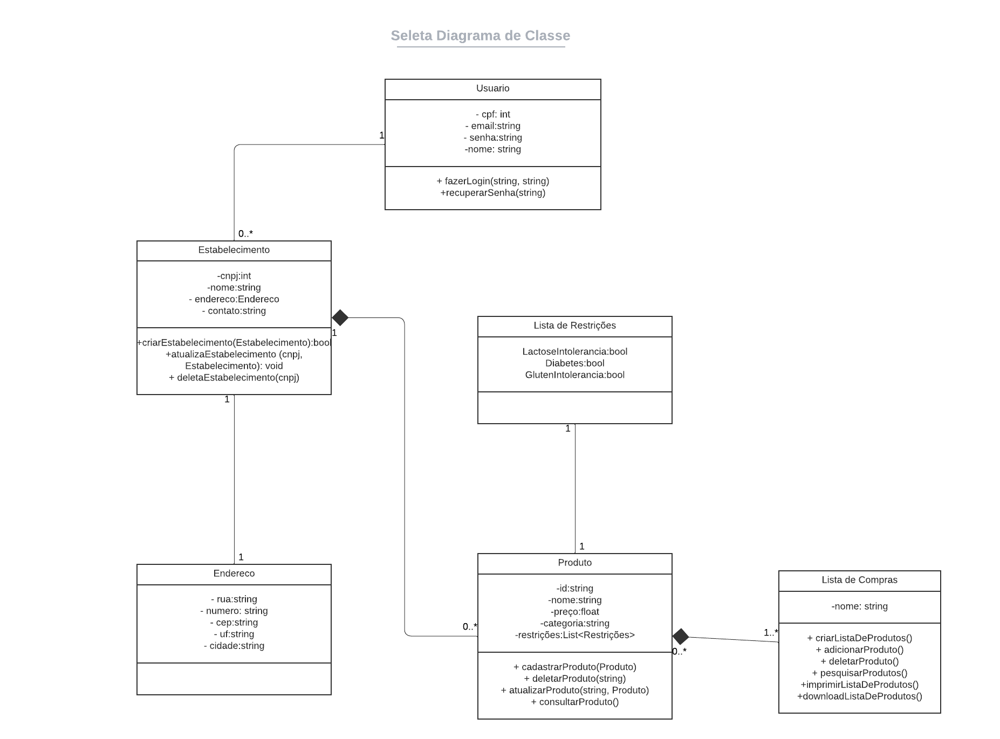
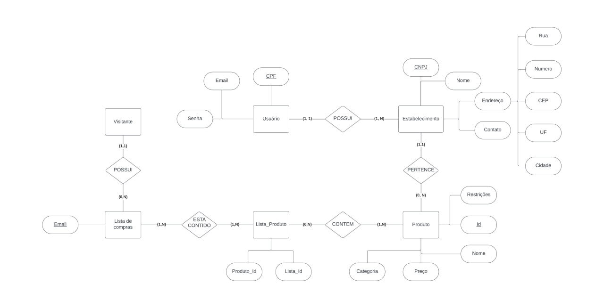

# Arquitetura da Solução

Definição de como o software é estruturado em termos dos componentes que fazem parte da solução e do ambiente de hospedagem da aplicação.

## Diagrama de Classes

O diagrama de classes ilustra graficamente como será a estrutura do software, e como cada uma das classes da sua estrutura estarão interligadas. Essas classes servem de modelo para materializar os objetos que executarão na memória.

 

 
<b>Figura 19</b> - Diagrama de classes
  
 

## Modelo ER (Projeto Conceitual)

O Modelo ER representa através de um diagrama como as entidades (coisas, objetos) se relacionam entre si na aplicação interativa.

 

 
<b>Figura 20</b>  - Diagrama Entidade-Relacionamento (ER)
  
 

## Projeto da Base de Dados

O projeto da base de dados corresponde à representação das entidades e relacionamentos identificadas no Modelo ER, no formato de tabelas, com colunas e chaves primárias/estrangeiras necessárias para representar corretamente as restrições de integridade.
 

 
<b>Figura 21</b>  - Projeto da Base de Dados

 

## Tecnologias Utilizadas

- Linguagens: C#, Javascript, HTML/CSS;
- Frameworks e/ou bibliotecas: Bootstrap, ASP.NET MVC, Entity Framework;
- IDEs: Visual Studio ou Visual Studio Code;
- Ferramentas: MySQL;

## Hospedagem

Explique como a hospedagem e o lançamento da plataforma foi feita.

> **Links Úteis**:
>
> - [Website com GitHub Pages](https://pages.github.com/)
> - [Programação colaborativa com Repl.it](https://repl.it/)
> - [Getting Started with Heroku](https://devcenter.heroku.com/start)
> - [Publicando Seu Site No Heroku](http://pythonclub.com.br/publicando-seu-hello-world-no-heroku.html)
