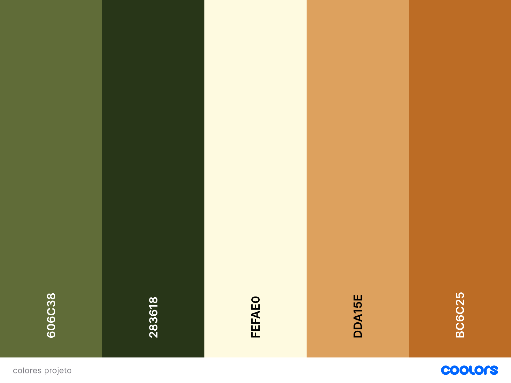
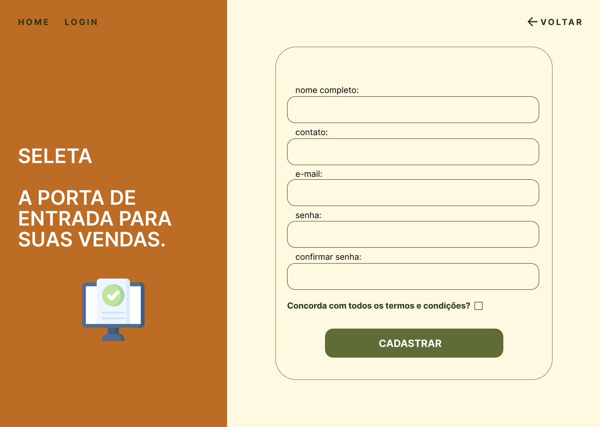
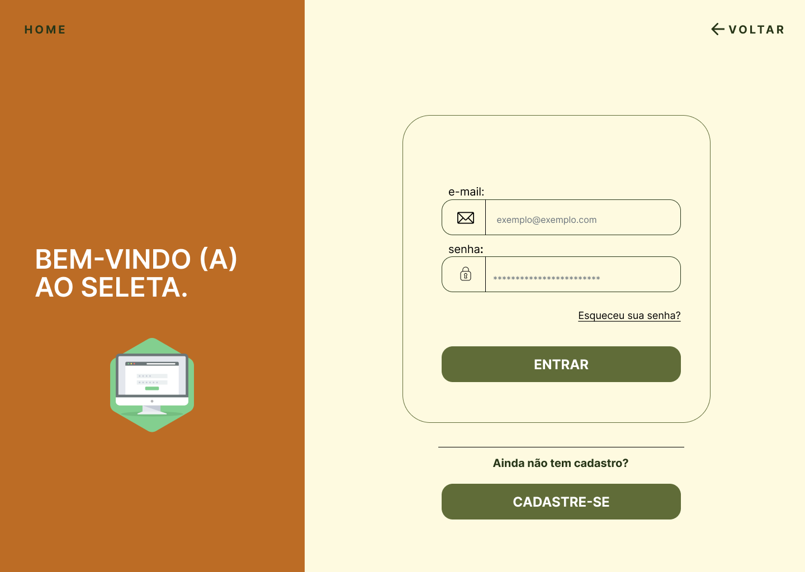

# Template Padrão da Aplicação

O layout padrão a ser utilizado pela aplicação tem correspondência ao projeto de Interface elaborado anteriormente.

## Paleta de Cores
 

 
<b>Figura 22</b> - Paleta de Cores

## Tipografia

 A fonte escolhida para a construção da interface foi a Inter, para garantir a legibilidade com um estilo moderno e uma sensação de harmonia. 
 

## Telas
Todas as telas apresentam um layout responsivo, tendo seu conteúdo ajustado para qualquer tamanho de tela. 
O template criado é composto pelos seguintes layouts:
- Home Page
- Tela Perfil do produto
- Tela Lista de compras
- Tela do Cadastro do usuário
- Tela da Login do usuário
- Tela Perfil do usuário
- Tela Cadastro do estabelecimento
- Tela Gerenciar estabelecimentos
- Tela Cadastro do produto
- Tela Gerenciar produtos

### Home Page

 A Home Page apresenta o propósito e os valores da plataforma por meio de um carrossel. Além disso, é a tela onde o usuário visitante pode fazer sua busca pelos produtos desejados, aplicando filtros. Nesta página, também se encontra o botão para criar uma lista de compras, tendo dicas de como realizar essa ação. A Home Page também permite que usuários (donos de estabelicimentos comerciais) façam seu cadastro ou façam login para acessar sua conta. 
 

 
<b>Figura 23</b>

 

 RF-001 - A aplicação deve apresentar na página inicial instruções sobre como navegar na plataforma 
 RF-002 - A aplicação deve permitir que o usuário visitante pesquise por produtos, resultando em todos os produtos equivalentes ao que foi pesquisado
 RF-003 - A aplicação deve permitir que o usuário visitante pesquise produtos de acordo com tipo específico de restrição alimentar, resultando em todos os produtos próprios para o tipo de restrição pesquisado
 RF-004 - A aplicação deve permitir que o usuário visitante busque por produtos desejados e/ou estabelecimentos de acordo com a localidade inserida no filtro de pesquisa
 RF-006 - A aplicação deve solicitar nome da lista e e-email para compartilhamento sempre que o usuário visitante criar uma lista de compras 
 RF-012 - A aplicação deve permitir que o usuário visitante busque por produtos desejados de acordo com a categoria inserida no filtro de pesquisa

 

### Tela - Perfil do produto

 Ao pesquisar os produtos desejados na página inicial, o usuário pode clicar em cima do botão "Ver detalhes" e o site será redirecionado para a página do Perfil do produto, onde se encontrarão a descrição e informações adicionais sobre o produto.
  
 

   

 
<b>Figura 24</b> - Tela de Perfil do produto
  

### Tela - Lista de compras

 A Lista de compras é a tela para onde o usuário é redirecionado após o usuário inserir seu e-mail e selecionar os produtos que deseja adicionar na lista. Nesta página, o usuário pode gerenciar os produtos e escolher se prefere fazer download da lista ou enviar para um e-mail.
  
 

   

 
<b>Figura 25</b> 
  
 

RF-013 - A aplicação deve oferecer a opção de realizar download da lista de compras elaborada
RF-014 - A aplicação deve oferecer a opção de enviar a lista de compras elaborada direto para o e-mail do usuário visitante
RF-005 - A aplicação deve permitir que o usuário visitante gerencie sua lista de compras com produtos selecionados

 

  ### Tela - Cadastro do usuário 

 Caso o usuário queira anunciar seus produtos no site, ele deverá clicar em um dos botões para ser redirecionado a página de cadastro. A tela de cadastro do usuário é utilizada para criar o acesso ao sistema. Caso já tenha cadastro, o usuário poderá ser direcionado para a tela de login também por essa tela. 
  
 

 
<b>Figura 26</b> 

 

RF-011 - A aplicação deve garantir que o estabelecimento indique claramente qual(is) restrição(ões) alimentar(es) o produto atende / RF-010 - A aplicação deve garantir que o estabelecimento forneça informações detalhadas sobre os produtos

 

### Tela - Login do usuário

 Para os usuários que já possuem uma conta, o acesso é feito pela tela de login. Para entrar, bastar clicar no botão "Login", o site será redirecionado para a tela e o usuário deve informar o email e senha escolhida no momento do cadastro. Caso seja o primeiro acesso do usuário, ele poderá ser direcionado para a tela de cadastro também por essa tela. 
  
 

 
<b>Figura 27</b> - Tela de Login/Entrar
  

  ### Tela - Perfil do usuário

 Tela de Perfil do usuário é o local onde o usuário poderá adicionar e gerenciar os seus estabelecimentos.
  
 

 
<b>Figura 28</b>

 

RF-007 - A aplicação deve permitir que o estabelecimento crie e gerencie os itens da sua conta

 

### Tela - Cadastro de estabelecimento

 Esta tela é onde o usuário irá colocar todas as informações pedidas para realizar o cadastro do seu estabelecimento no site.
  
 

 
<b>Figura 29</b> 

 

RF-008 - A aplicação deve permitir ao estabelecimento especificar a sua localidade

 

### Tela - Gerenciar estabelecimentos

 Esta tela é onde o usuário poderá escolher um de seus estabelecimentos cadastrados para abrir seu perfil, editar suas as informações ou até mesmo excluir o estabelecimento da plataforma.
  
 

 
<b>Figura 30</b> - Tela de Gerenciamento de estabelecimentos
  

### Tela - Cadastro de produto

 Ao clicar em cadastrar produto, o usuário será direcionado para essa tela, onde ele irá inserir todas as informações pedidas sobre o novo produto e, no final da página, clicará em Cadastrar para subir o produto para a plataforma.
  
 

 
<b>Figura 31</b> - Tela de Cadastro de produtos
  

### Tela - Gereciar produtos

 Ao clicar em um estabelecimento, o site será redirecionado para essa tela, onde aparecerão todos os produtos cadastrados neste estabelecimento. O usuário pode escolher cadastrar um novo produto, editar ou excluir um produto já cadastrado.
  
 

 
<b>Figura 32</b> 

 

RF-009 - A aplicação deve permitir que o estabelecimento adicione e gerencie seus produtos

 
